# PROJECT_ARCHITECTURE.md

# Floating Uploads

Version: 1.0

---

# 1. Project Overview

## Problem Statement

Many YouTube creators hire editors, managers, freelancers, or agencies to prepare content.

The common problem is that creators do not want to give full YouTube access to every editor because:

- It is a security risk.
    
- Videos can be uploaded accidentally.
    
- Metadata can be modified without approval.
    
- Scheduled uploads can be changed without notice.
    

This platform acts as a bridge between channel owners and uploaders.

Instead of granting direct YouTube upload access, uploaders create upload requests inside the platform.

The owner reviews the request and decides whether to:

- Approve and upload immediately
    
- Approve and schedule upload
    
- Reject the request
    

This ensures the owner remains in full control of the YouTube channel.

---

# 2. Core Concept

```text
Owner Connects Channel
        ↓
Owner Appoints Uploader
        ↓
Uploader Creates Upload Request
        ↓
Pending Review
        ↓
Owner Reviews Request
        ↓
Approve / Reject
        ↓
Upload / Schedule
        ↓
Uploaded
```

---

# 3. User Types

## Owner

Channel owner.

Responsibilities:

- Connect YouTube channels
    
- Appoint uploaders
    
- Remove uploaders
    
- Review upload requests
    
- Edit title
    
- Edit description
    
- Add/change thumbnail
    
- Approve uploads
    
- Schedule uploads
    
- Reject uploads
    

---

## Uploader

A normal user of the platform who has been granted permission by an owner.

Responsibilities:

- Create upload requests
    
- Upload video files
    
- Add title
    
- Add description
    
- Add optional note
    
- Edit draft requests
    
- Delete draft requests
    
- Monitor request status
    

Uploaders never upload directly to YouTube.

---

# 4. Permission Model

Permissions are granted per channel.

Available permissions:

```text
SHORTS
LONG_VIDEO
BOTH
```

Examples:

```text
Nature Hub
 └── John
     └── SHORTS

Gaming Hub
 └── Alex
     └── BOTH
```

---

# 5. Upload Request Lifecycle

## Complete Status List

```text
Draft
Pending Review
Approved
Scheduled
Uploading
Uploaded
Rejected
Failed
```

---

## Status Flow

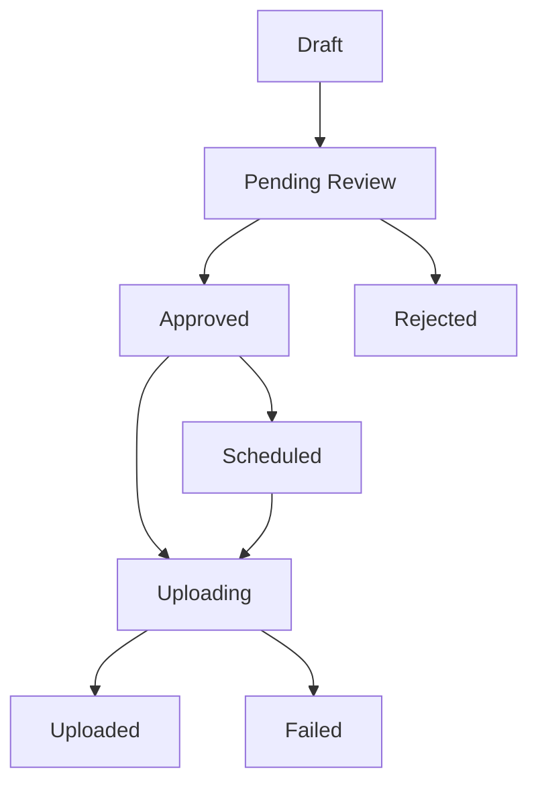

---

# 6. High Level System Workflow

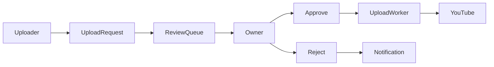

---

# 7. Application Navigation

## Sidebar

```text
Appoint Uploader

Review Request

Uploader Section

Settings
```

---

# 8. Authentication Flow

## Login Page

Features:

- Product description
    
- Google Login button
    

Authentication Provider:

```text
Google OAuth
```

Implemented using:

```text
NextAuth.js
```

---

## Username Generation

After first login:

```text
Google Name
     ↓
Generate Unique Username
```

Example:

```text
John Doe

↓

john_doe_8214
```

User may later change username if available.

---

# 9. Navbar

## Left Side

```text
upload-monitor-yt
```

---

## Right Side

```text
Notification Bell

Username

Profile Dropdown
```

---

# 10. Notifications

Notifications are generated for:

## Owner

```text
New Upload Request

Request Approved

Request Rejected

Upload Failed

Upload Completed
```

---

## Uploader

```text
Uploader Access Granted

Request Approved

Request Rejected

Upload Completed

Upload Failed
```

---

## Notification Actions

Clicking notification redirects user to relevant screen.

Example:

```text
Request Approved

↓

Request Details
```

---

## Email Notifications

Notifications are also sent via email.

Provider:

```text
Resend
```

---

# 11. Appoint Uploader Section

Purpose:

Manage uploader access for connected channels.

---

## Empty State

```text
No channel connected.

Connect a YouTube channel to continue.
```

---

## Channel Card Information

Each channel card displays:

```text
Channel Profile Picture

Channel Name

YouTube Handle

Pending Review Count
```

Example:

```text
Nature Hub

@naturehub

4 Pending Reviews
```

---

# 12. Connect Channel Flow

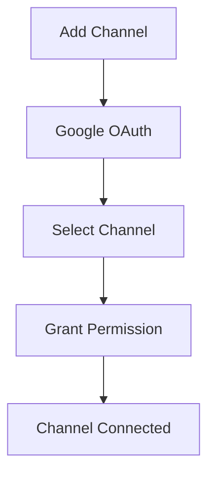

---

# 13. Appoint Uploader Flow

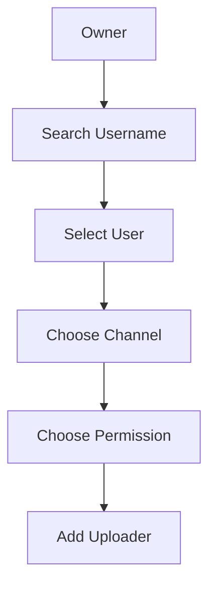

---

## Add Uploader Modal

Fields:

```text
Uploader Username

Channel

Permission Type
```

Permission Options:

```text
Shorts

Long Video

Both
```

---

# 14. Uploader Assignment Table

Columns:

```text
Uploader

Permission Type

Granted Date

Actions
```

Actions:

```text
Update Permission

Remove Uploader
```

---

# 15. Permission Update Flow

Owner can modify permissions later.

Example:

```text
SHORTS

↓

SHORTS + LONG_VIDEO
```

Permission updates must be logged.

---

# 16. Remove Uploader Rules

When uploader access is removed:

```text
Cannot create new requests
```

Existing requests:

```text
Remain visible

Become read-only
```

Assignment records should never be deleted permanently.

Use:

```text
grantedAt

revokedAt
```

for history tracking.

---

# 17. Review Request Section

Purpose:

Allow owners to review incoming upload requests.

---

## Request Grouping

### Pending Review

All pending requests appear at top.

```text
Pending Review (4)
```

---

### Reviewed Requests

Below pending requests.

```text
Uploaded

Scheduled

Declined
```

Example:

```text
Reviewed Requests (12)
```

---

# 18. Review Request List Item

Information displayed:

```text
Uploader Name

Request Name

Video Type

Created Date
```

Example:

```text
John

Nature Documentary

Long Video

16 Jun 2026
```

---

# 19. Empty State

```text
No upload requests found.
```

---

# PROJECT_ARCHITECTURE.md

# PART 2

---

# 20. Upload Request Review Page

Purpose:

Allow channel owners to review requests before content is uploaded to YouTube.

This page is scrollable.

---

## Request Header

Information shown at top:

```text
Request Name

Uploader Name

Upload Type
```

Example:

```text
Nature Documentary Video

By: John

Type: Long Video
```

---

## Optional Note Section

Uploaders may include a note.

Example:

```text
Please review the intro section before uploading.
```

Notes are optional.

---

## Video Preview Section

Purpose:

Allow owner to fully review content before approval.

Owner can:

```text
Play

Pause

Seek

Watch Entire Video
```

---

## Video Information

Displayed automatically from FFprobe metadata.

```text
Resolution

File Size
```

Example:

```text
Resolution: 1920x1080

Size: 824 MB
```

Duration should not be shown separately.

Duration already appears inside the video player UI.

---

## Editable Fields

Owner may modify:

### Title

```text
Natural African Documentary in 4K
```

---

### Description

```text
Complete YouTube description
```

---

### Thumbnail

Only owner can modify thumbnail.

Uploader cannot change thumbnail.

Owner can:

```text
Upload Thumbnail

Replace Thumbnail

Remove Thumbnail
```

---

# 21. Approval Actions

Available actions:

```text
Upload

Schedule
```

---

## Direct Upload

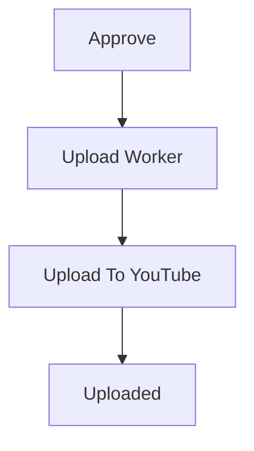

---

## Scheduled Upload

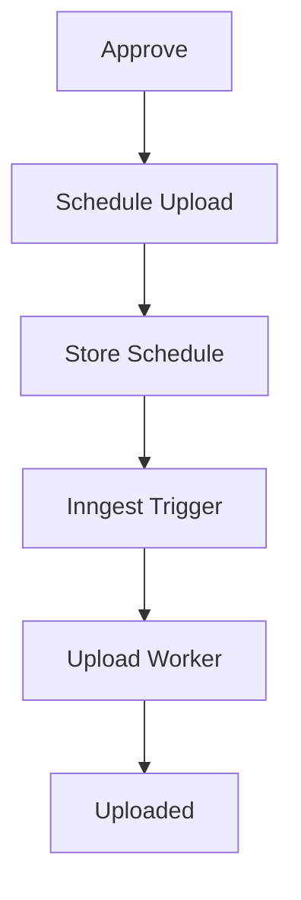

---

## Schedule Modal

Required fields:

```text
Date

Time

Timezone
```

Default timezone:

```text
Asia/Kolkata
```

Database storage:

```text
UTC
```

---

## Final Actions

```text
Approve

Decline
```

---

# 22. Reviewed Request Page

Once request is:

```text
Uploaded

Scheduled

Rejected
```

Full review page is no longer necessary.

Instead open:

```text
Request Details

Request History
```

---

# 23. Request History System

Every request maintains complete lifecycle history.

---

## Example Timeline

```text
10:00 AM
Request Created

10:05 AM
Title Updated

10:10 AM
Description Updated

10:15 AM
Submitted For Review

11:00 AM
Approved

11:01 AM
Scheduled

06:00 PM
Upload Started

06:03 PM
Upload Completed
```

---

## Mermaid Flow

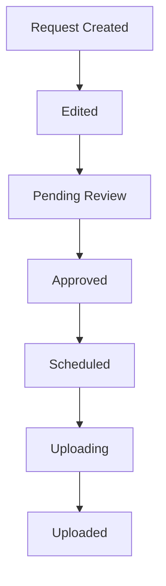

---

# 24. Uploader Section

Purpose:

Allow uploaders to create and manage upload requests.

---

## Internal Navigation

Uploader section contains:

```text
Create Request

Request Status
```

---

# 25. Channel Selection Page

Shows all channels uploader has access to.

Each card displays:

```text
Channel Profile Picture

Channel Name

YouTube Handle

Permission Type
```

---

## Example

```text
Nature Hub

@naturehub

Shorts Access
```

---

## Empty State

```text
No channel access granted.

Ask a channel owner to grant access.
```

---

# 26. Create Upload Request

Fields:

---

## Request Name

Internal request identifier.

Example:

```text
Nature Documentary Upload
```

---

## Note

Optional note for owner.

Example:

```text
Upload after reviewing intro section.
```

---

## Video Upload

Supported through:

```text
TUS Protocol
```

Storage:

```text
Local uploads/ folder via storage provider abstraction
```

---

## Title

YouTube title suggestion.

---

## Description

YouTube description suggestion.

---

## Actions

```text
Save Draft

Send Request
```

---

# 27. Draft Workflow

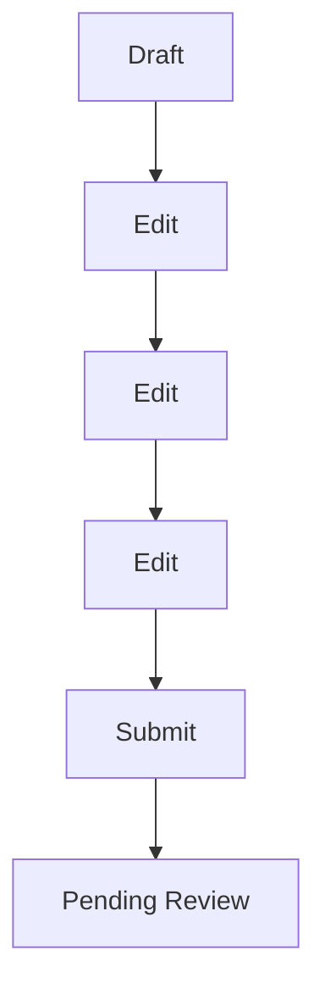

---

# 28. Request Status Page

Uploader can view all requests.

Grouped by status.

---

## Statuses

```text
Draft

Pending Review

Approved

Scheduled

Uploading

Uploaded

Rejected

Failed
```

---

## Example

```text
Nature Documentary
Pending Review

Funny Cats
Uploaded

Gaming Highlights
Rejected
```

---

# 29. Request Editing Rules

## Draft

Allowed:

```text
Edit

Delete

Resubmit
```

---

## Pending Review

Allowed:

```text
View
```

Not allowed:

```text
Edit

Delete
```

---

## Approved

Allowed:

```text
View
```

---

## Uploaded

Allowed:

```text
View
```

---

## Rejected

Allowed:

```text
View
```

---

# 30. Upload Pipeline

High-level flow:

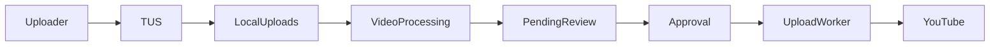

---

# 31. Video Processing Flow

After upload completion:

```text
Generate Metadata

Generate Thumbnail

Validate Video

Store Metadata
```

---

## FFmpeg Responsibilities

```text
Thumbnail Generation

Video Validation

Compression (Future)
```

---

## FFprobe Responsibilities

```text
Duration

Resolution

Codec

File Size

Frame Rate
```

---

# 32. Cloudflare R2 Storage

Purpose:

Store uploaded videos before approval.

---

## Workflow

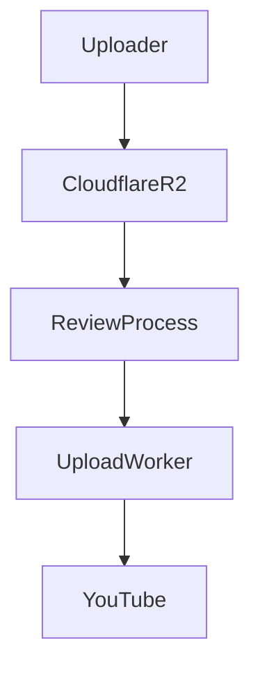

---

## Why Use R2

Benefits:

```text
Lower Storage Cost

No Egress Fees

Scalable

Simple Integration
```

---

# 33. Notification System

Purpose:

Keep users informed.

---

## Notification Types

### Owner

```text
New Request

Upload Completed

Upload Failed
```

---

### Uploader

```text
Access Granted

Request Approved

Request Rejected

Upload Completed

Upload Failed
```

---

# 34. Notification Flow

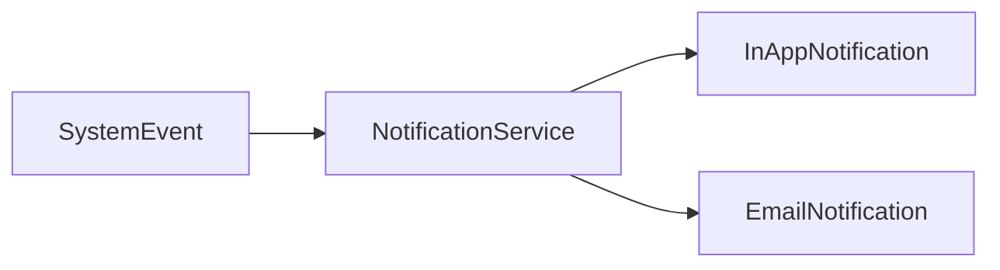

---

# 35. Email System

Provider:

```text
Resend
```

---

## Email Templates

```text
Uploader Assigned

Request Submitted

Request Approved

Request Rejected

Upload Completed

Upload Failed
```

---

# 36. Activity Log

Purpose:

Human-readable history.

Examples:

```text
John submitted request

Owner approved request

Upload scheduled

Upload completed
```

---

## Difference

Activity Log:

```text
Readable Timeline
```

Audit Log:

```text
System Evidence
```

---

# 37. Audit Log

Purpose:

Track every important action.

---

## Examples

```text
Uploader Assigned

Uploader Removed

Permission Updated

Request Created

Request Updated

Request Approved

Request Rejected

Upload Started

Upload Completed

Upload Failed
```

---

## Never Delete Audit Logs

Audit logs must remain permanent.

---

# 38. Permission Removal Rules

When uploader is removed:

```text
Cannot Create New Requests
```

Existing requests:

```text
Remain Visible

Become Read Only
```

Assignment should be revoked.

Never hard delete.

Use:

```text
grantedAt

revokedAt
```

---

# 39. Error Handling

Failed uploads move to:

```text
Failed
```

Owner receives:

```text
Notification

Email
```

Uploader receives:

```text
Notification

Email
```

---

# 40. Logging Strategy

Provider:

```text
Pino
```

Log categories:

```text
API

Uploads

Authentication

Payments

Notifications

Worker Jobs
```

---

# 41. Technology Stack

## Frontend

```text
Next.js (App Router)

TypeScript

ShadCN UI

Tailwind CSS
```

---

## Backend

```text
Next.js Route Handlers

TypeScript
```

---

## Database

```text
PostgreSQL
```

ORM:

```text
Prisma
```

---

## Validation

```text
Zod
```

---

## Authentication

```text
NextAuth.js
```

---

## Storage

```text
Cloudflare R2
```

---

## Upload Protocol

```text
TUS
```

---

## Queue & Background Jobs

```text
Inngest
```

---

## Caching

```text
Redis
```

---

## Payments

```text
Razorpay
```

---

## Email

```text
Resend
```

---

## Video Processing

```text
FFmpeg

FFprobe
```

---

## Logging

```text
Pino
```

---

# 42. High-Level Architecture

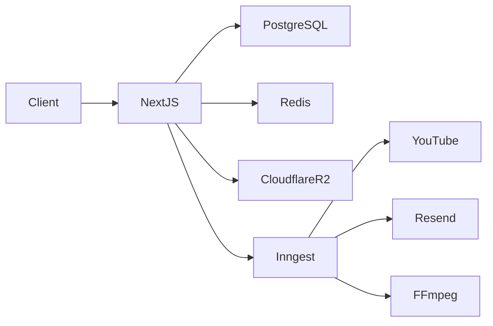

---

# 43. Architectural Principles

The application follows:

```text
Modular Monolith
```

Not:

```text
Microservices
```

---

## Reasons

Benefits:

```text
Simple Deployment

Easy Development

Low Operational Cost

Fast Iteration

Easy Debugging

Scales Well For V1/V2
```

---

# 44. Folder Structure

```text
upload-monitor-yt/
│
├── app/
├── components/
├── modules/
├── lib/
├── prisma/
├── emails/
├── inngest/
├── scripts/
├── config/
├── public/
├── tests/
├── logs/
├── types/
│
├── middleware.ts
├── auth.ts
├── env.ts
├── instrumentation.ts
├── next.config.ts
└── package.json
```

---

# 45. App Router Structure

```text
app/
│
├── (public)/
│   ├── page.tsx
|   ├── layout.tsx
|   ├── global.css
│   ├── login/
│   └── pricing/
│
├── (dashboard)/
│   ├── appoint-uploader/
│   ├── review-request/
│   ├── uploader/
│   ├── notifications/
│   └── settings/
│
├── api/
│
│   ├── auth/
│   ├── channels/
│   ├── uploaders/
│   ├── upload-requests/
│   ├── uploads/
│   ├── notifications/
│   ├── payments/
│   └── webhooks/
│
├── loading.tsx
├── error.tsx
└── not-found.tsx
```

---

# 46. Component Architecture

```text
components/
│
├── ui/
│
├── layout/
│
├── channel/
│
├── uploader/
│
├── request/
│
├── video/
│
└── shared/
```

---

## Rules

Components must:

```text
Contain UI Logic Only
```

Never contain:

```text
Database Queries

Business Logic

Storage Logic
```

---

# 47. Module Architecture

Business logic lives inside modules.

```text
modules/
│
├── auth/
├── users/
├── channels/
├── uploaders/
├── upload-requests/
├── uploads/
├── notifications/
├── payments/
├── storage/
├── media/
├── audit/
└── activity/
```

---

# 48. Module Structure Standard

Every module follows:

```text
module-name/
│
├── dto/
├── validators/
├── repositories/
├── services/
├── permissions/
├── constants/
├── types/
└── index.ts
```

---

# 49. Service Layer

Services contain business logic.

Example:

```text
create-request.service.ts

approve-request.service.ts

reject-request.service.ts

schedule-request.service.ts
```

---

## Responsibilities

```text
Validation

Permission Checks

Business Rules

Event Dispatching
```

---

# 50. Repository Layer

Repositories handle database access.

Example:

```text
upload-request.repository.ts
```

---

## Responsibilities

```text
Find

Create

Update

Delete
```

Only repositories communicate with Prisma.

---

# 51. Validation Layer

All inputs validated with:

```text
Zod
```

Example:

```text
create-request.schema.ts
```

Validation happens before service execution.

---

# 52. Multi File Prisma Architecture

Purpose:

Avoid gigantic schema.prisma files.

---

## Structure

```text
prisma/
│
├── schema.prisma
│
├── schema/
│
│   ├── base/
│   │
│   ├── enums/
│   │
│   ├── models/
│   │
│   └── relations/
│
└── seed/
```

---

# 53. Base Prisma Files

```text
base/
│
├── datasource.prisma
└── generator.prisma
```

---

# 54. Enum Files

```text
enums/
│
├── permission.prisma
├── notification.prisma
├── upload-request-status.prisma
├── upload-type.prisma
└── payment-status.prisma
```

---

# 55. Model Files

```text
models/
│
├── user.prisma
├── channel.prisma
├── uploader-assignment.prisma
├── upload-request.prisma
├── upload-job.prisma
├── notification.prisma
├── activity.prisma
├── audit-log.prisma
├── payment.prisma
├── email-log.prisma
└── video-metadata.prisma
```

---

# 56. Prisma Merge Script

Purpose:

Combine all schema fragments.

---

## Script

```text
scripts/

merge-prisma.ts
```

---

## Workflow

```bash
npm run prisma:merge

npm run prisma:generate

npm run prisma:migrate
```

---

# 57. Core Database Models

## User

Stores platform users.

Responsibilities:

```text
Authentication

Username

Profile
```

---

## Channel

Stores connected YouTube channels.

Responsibilities:

```text
Channel Information

OAuth Information

Owner Relationship
```

---

## UploaderAssignment

Stores uploader access.

Responsibilities:

```text
Permission Management

Grant History

Revoke History
```

---

## UploadRequest

Stores request data.

Responsibilities:

```text
Request Metadata

Review Status

Approval Lifecycle
```

---

## VideoMetadata

Stores FFprobe data.

Responsibilities:

```text
Resolution

Duration

Codec

File Size

FPS
```

---

## UploadJob

Stores upload worker state.

Responsibilities:

```text
Scheduled Uploads

Retries

Failures
```

---

## Notification

Stores notifications.

---

## Activity

Stores activity timeline.

---

## AuditLog

Stores permanent audit records.

---

# 58. Redis Architecture

Purpose:

Improve performance.

---

## Use Cases

```text
Rate Limiting

Caching

Temporary Session Data

Queue Coordination
```

---

# 59. Rate Limiting

Protected endpoints:

```text
Login

Username Updates

Uploader Search

Upload Requests

Notifications
```

---

## Strategy

```text
IP Based

User Based
```

---

# 60. Inngest Architecture

Purpose:

Background processing.

---

## Event Driven Design

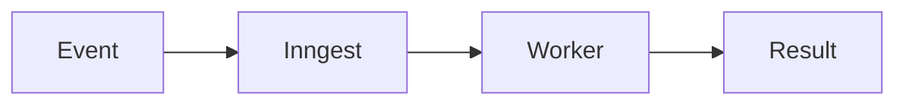

---

# 61. Inngest Functions

```text
upload-video.ts

schedule-upload.ts

send-email.ts

send-notification.ts

generate-thumbnail.ts

process-video.ts

cleanup-expired-files.ts
```

---

# 62. Event Catalog

```text
upload.request.created

upload.request.approved

upload.request.rejected

upload.request.scheduled

upload.started

upload.completed

upload.failed
```

---

# 63. Storage Module

Purpose:

Abstract Cloudflare R2.

---

## Structure

```text
modules/storage/
│
├── providers/
├── services/
└── constants/
```

---

## Responsibilities

```text
Upload Files

Delete Files

Generate URLs

Signed URLs
```

---

# 64. Upload Architecture

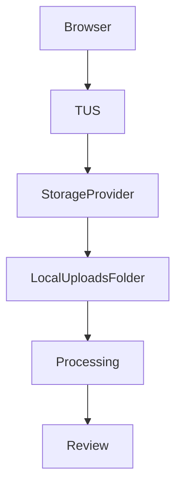

---

## Benefits

```text
Resumable Uploads

Large File Support

Reliable Uploads
```

---

# 65. Media Module

Purpose:

Video processing.

---

## Structure

```text
modules/media/
│
├── ffmpeg/
├── services/
└── types/
```

---

## FFmpeg Tasks

```text
Thumbnail Generation

Video Validation

Future Compression
```

---

## FFprobe Tasks

```text
Resolution

Duration

Codec

FPS

Bitrate

File Size
```

---

# 66. Authentication Architecture

Provider:

```text
Google OAuth
```

---

## User Creation Flow

```mermaid
flowchart TD

Google Login

Google Login
--> User Exists

User Exists
--> Session

Google Login
--> New User

New User
--> Username Generation

Username Generation
--> Session
```

---

# 67. Email Architecture

```text
emails/
│
├── layouts/
└── templates/
```

---

## Templates

```text
uploader-assigned

request-created

request-approved

request-rejected

upload-completed

upload-failed
```

---

# 68. Payment Architecture

Provider:

```text
Razorpay
```

---

## Responsibilities

```text
Subscriptions

Invoices

Webhook Verification

Payment History
```

---

## Webhooks

```text
payment.captured

payment.failed

subscription.activated

subscription.cancelled
```

---

# 69. Logging Architecture

Provider:

```text
Pino
```

---

## Categories

```text
API

Authentication

Storage

Uploads

Notifications

Payments

Workers
```

---

# 70. Environment Variables

## Database

```env
DATABASE_URL=
```

---

## Authentication

```env
AUTH_SECRET=

GOOGLE_CLIENT_ID=

GOOGLE_CLIENT_SECRET=
```

---

## Redis

```env
REDIS_URL=
```

---

## Cloudflare R2

```env
R2_ACCESS_KEY=

R2_SECRET_KEY=

R2_BUCKET=

R2_ENDPOINT=
```

---

## Resend

```env
RESEND_API_KEY=
```

---

## Razorpay

```env
RAZORPAY_KEY_ID=

RAZORPAY_SECRET=
```

---

## Inngest

```env
INNGEST_EVENT_KEY=
```

---

# 71. Security Guidelines

## Never Store

```text
Google Client Secret

Google Refresh Tokens In Logs

R2 Credentials In Logs
```

---

## Always Validate

```text
Request Payloads

Webhook Payloads

Query Parameters

File Upload Metadata
```

---

## Always Authorize

```text
Channel Ownership

Uploader Access

Request Access
```

---

# 72. Future Roadmap

Potential future features:

```text
Teams

Agencies

Multi Owner Channels

Analytics

AI Metadata Suggestions

Thumbnail Editor

Bulk Uploads

API Access

Mobile App
```

---

# 73. Scalability Strategy

Current Architecture Target:

```text
Single Application

Single Database

Single Redis

Single R2 Bucket
```

---

Expected Capacity:

```text
Thousands Of Users

Thousands Of Channels

Tens Of Thousands Of Requests
```

Without moving to microservices.

---

# 74. Final Architecture Summary

System Design:

```text
Next.js App Router

Modular Monolith

Prisma

PostgreSQL

Redis

Cloudflare R2

TUS

Inngest

Resend

Razorpay

FFmpeg

Pino
```

Core Philosophy:

```text
Uploader Creates Request

Owner Reviews Request

Owner Controls Upload

System Maintains Auditability
```

This principle should guide every future feature and architectural decision.

---
